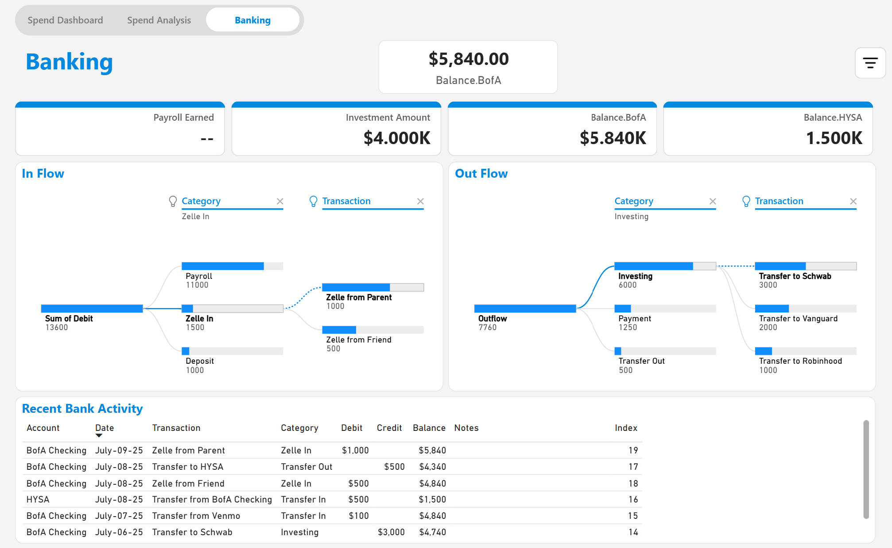

# 💰 Personal Finance Tracker – Power BI

This Power BI dashboard provides a full overview of personal finances using bank and credit card transaction data.

## 📊 Key Features
- 💳 Credit Card Spend Analysis
- 🔄 Cash Flow tracking: Inflow vs Outflow
- 💸 Estimated Cashback per transaction
- 📅 Time filtering with dynamic date slicers
- 👥 Multi-user toggle (User 1 / User 2)

## 🔧 Built With
- Power BI Desktop
- DAX (Date calculations, conditional formatting)
- Power Query (data transformation)
- Excel (source data)

## 📷 Screenshots

### Spend Dashboard

### Spend Analysis

### Banking View

## 🗃️ Files Included
- `Finances Power BI v2.pbix`: Power BI dashboard file
- `Finances Excel v2.xlsx`: Sample data source
- PNG files: Dashboard screenshots

---

📅 Project Completed: **September 2025**  
📍 Personal Portfolio Project  
# Personal-Finance-Tracker
A Power BI dashboard for tracking personal finances
